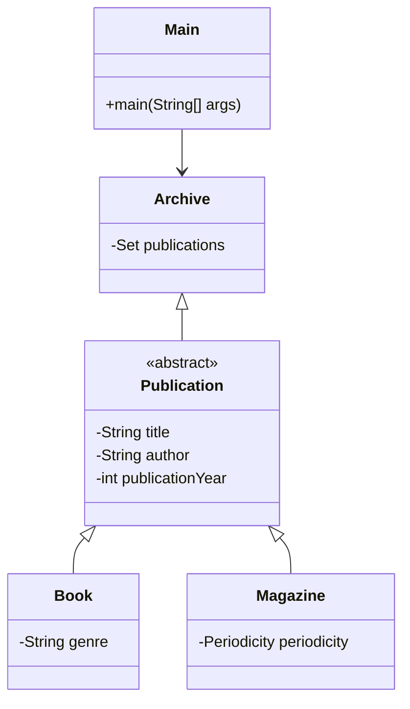

# Project Structure

## Visual Representation

## Classes notes

### Publication

There is an abstract class `Publication` that
represents all types of publications (`Book`
and `Article` in this case).
Each publication has a title, author,
and year of publication.

### Book and Magazine

`Book` and `Magazine` are concrete classes
that extend the `Publication` class.
`Book` has a genre and author,
and `Magazine` has a periodicity.

### Archive

`Archive` is a class that contains a set of
`Publication` objects. It has methods to add and
modify publications. Archive also has all info
methods to get statistics of data.

