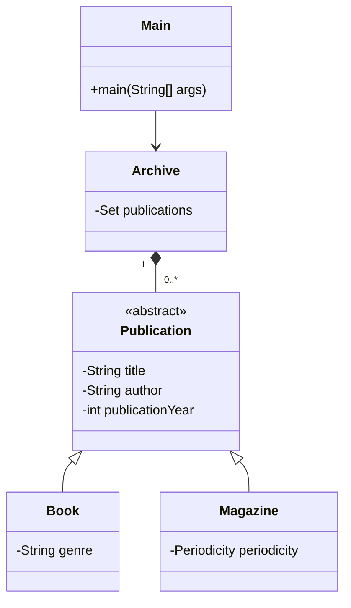

# Project Structure

There is an abstract class `Publication` that
represents all types of publications (`Book`
and `Article` in this case).
Each publication has a title, author,
and year of publication.

